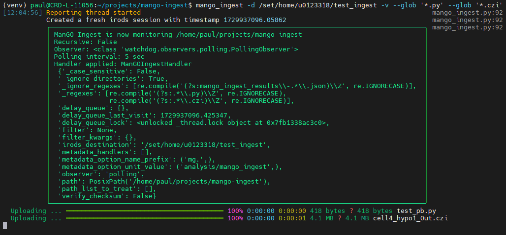

## Purpose



ManGO ingest is a lightweight command line tool to monitor a local directory for file
changes and ingest (part of) them into iRODS, **including metadata handling**. There is no need for ~~cronjobs~~
as it is based on python watchdog which starts its own threads for continous
monitoring.

The main purpose it to be an easy entry point for ingestion of files into
iRODS, from where possibly a ManGO Flow task or iRODS rule will pick up and handle further
processing

Metadata handling can be done with built in options to pick up metadata items from path elements. It is also possible to add custom functions to extract / add metadata from the file to be uploaded or any other related source.

Filtering options include **glob** `--glob` and **regular expressions** `--regex` for both black and white listing. Also here, a custom function can be provided to implement some domain specific logic, typically *is the file ready to be uploaded based on \<a domain specific criterium>?*

See also `doc/examples`

## Current state of supported platforms

The initial development is focusing on Linux, but the target platforms are 
also including Windows and Mac OS. It may or may not work for you (yet), please
use the issue tracker to report on your findings/use cases and more..

## Installation

### Recommended

- check out this repository and cd into it
- run the following commands
```bash
$ python -m venv venv
$ . venv/bin/activate
$ pip install --editable .
```
Afterwards verify the executable `mango_ingest` is available in your PATH

```bash
$ mango_ingest --help
```

### Quick checkout

Just checkout the repository and copy the script `mango_ingest.py` around to where you want to execute it

### Authentication

Authentication is done by creating an `iRODSSession` from a configuration file either as specified by the environment variable `IRODS_ENVIRONMENT_FILE` or with a fallback to the current user `~/.irods/irods_environment.json`.

## Usage

See the command line `--help` option